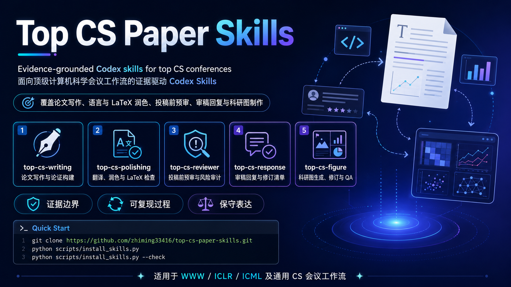

# Top CS Paper Skills

[English](README_EN.md) · [安装指南](INSTALL.md) · [完整工作流](docs/WORKFLOW.md) · [宿主兼容](docs/HOSTS.md) · [技能索引](#技能索引) · [文档导航](docs/README.md) · [参与贡献](CONTRIBUTING.md)

面向计算机科学论文工作流的五个专项技能：从论证与写作，到保真润色、投稿前预审、审稿回复和可复现科研图件。它们以证据边界、可追溯的输入输出和保守表述为共同原则。另有可选的 `top-cs-paper-workflow` 协调包，用于长期、跨技能的完整论文项目；它不是第六个专项技能。

## 适用范围与边界

- 当前会议证据快照覆盖 WWW Research、ICLR 和 ICML 2026；提交前始终应重新核对目标会议的官方页面。
- `generic` 模式提供通用写作、审查和证据检查，不会将历史经验包装为会议当前政策。
- 仓库只发布原创代码、文档、合成图件和聚合证据；不包含论文全文、审稿原文、私有实验数据、用户材料或凭证。
- 完整工作流只登记用户明确选择的项目文件的相对路径和可选哈希，不复制或上传稿件、数据、PDF 或审稿材料。
- 证据来源、快照范围、已知局限和隐私边界见 [Evidence and provenance](docs/EVIDENCE.md)。

## 快速开始

最省事的方式是把下面的提示词发给 Codex：

~~~text
请从 https://github.com/zhiming33416/top-cs-paper-skills.git 安装全部 Top CS Paper Skills 到 Codex。
请 clone 仓库并运行：
python scripts/install_skills.py --host codex
python scripts/install_skills.py --host codex --check
请保留完整的 skills/top-cs-*、skills/_shared 和派生 evidence 目录；不要只复制 SKILL.md。
安装完成后提醒我开启新的 Codex 会话。
~~~

也可以手动安装：

~~~bash
git clone https://github.com/zhiming33416/top-cs-paper-skills.git
cd top-cs-paper-skills
python scripts/install_skills.py --host codex
python scripts/install_skills.py --host codex --check
~~~

需要跨阶段管理一篇完整论文时，额外安装协调包：

~~~bash
python scripts/install_skills.py --workflow --host codex
python scripts/install_skills.py --workflow --host codex --check
~~~

默认目标是 `~/.codex/skills`。单技能、Claude Code、更新、`--prune`、Windows/macOS/Linux 与排错说明见 [INSTALL.md](INSTALL.md)。

## 选择技能

| 你的目标 | 优先使用 | 你提供 | 主要交付 |
| --- | --- | --- | --- |
| 从结果与想法开始搭建论文 | [top-cs-writing](skills/top-cs-writing/README.md) | 研究问题、结论、目标章节 | 论证结构、章节大纲、英文草稿 |
| 保真翻译、压缩或调整 LaTeX | [top-cs-polishing](skills/top-cs-polishing/README.md) | 原文、修改范围、格式约束 | 修订文本与可核查修改台账 |
| 投稿前发现技术与实验风险 | [top-cs-reviewer](skills/top-cs-reviewer/README.md) | 稿件、附录、目标会议与审查模式 | 按优先级排序的作者侧风险审计 |
| 回复评审并跟踪修订 | [top-cs-response](skills/top-cs-response/README.md) | review、已有证据、修订状态 | issue 矩阵、逐点回复、修订台账 |
| 制作或审查投稿级图件 | [top-cs-figure](skills/top-cs-figure/README.md) | figure brief、CSV 或 render spec | 可编辑图件、导出包、视觉 QA 报告 |
| 管理完整论文项目及跨技能交接 | [top-cs-paper-workflow](skills/top-cs-paper-workflow/README.md)（可选） | 明确选择的项目根目录与阶段材料索引 | 状态检查、缺口提示和交接清单 |

## 技能索引

| 技能 | 阶段 | 你提供什么 | 得到什么 | 可以直接这样请求 |
| --- | --- | --- | --- | --- |
| [top-cs-writing](skills/top-cs-writing/README.md) | 规划与起草 | 贡献、证据、论文类型、章节、会议 | 论证图、提纲、草稿与待补证据 | “使用 top-cs-writing，根据这些实验结果规划 ICLR Introduction。” |
| [top-cs-polishing](skills/top-cs-polishing/README.md) | 保真修订 | 中文/英文段落或 LaTeX、修改目标 | 修订版本、修改台账、未决输入 | “使用 top-cs-polishing，把这段中文改成简洁学术英语，不加强主张。” |
| [top-cs-reviewer](skills/top-cs-reviewer/README.md) | 投稿前审计 | 稿件、实验、附录、目标会议 | 技术、实验、复现与范围风险 | “使用 top-cs-reviewer，审查这篇 WWW 稿件的主要拒稿风险。” |
| [top-cs-response](skills/top-cs-response/README.md) | 评审讨论与修订 | 审稿意见、已有结果、修订状态 | 回复草稿、证据映射、revision ledger | “使用 top-cs-response，把这些意见整理成逐点回复和修订清单。” |
| [top-cs-figure](skills/top-cs-figure/README.md) | 图件生产与 QA | 数据、图件任务书、输出格式 | SVG/PDF/PNG、渲染记录、质量检查 | “使用 top-cs-figure，根据 CSV 生成可编辑的 benchmark 与 ablation 图。” |

每个专项技能详情页都说明适用任务、输入、输出、边界、依赖和相关技能。`skills/_shared` 是共同依赖，不是第六个独立技能。

## 可选完整论文工作流

当任务只涉及一个阶段时，直接调用上面的专项技能即可。对于一篇会经历多轮写作、作图、预审和回复的论文，安装可选协调包，使用一个用户指定的项目根目录保存可恢复的状态：

~~~text
贡献与论证 ──> 证据与主图 ──> 稿件与润色 ──> 投稿前预审 ──> 回复与修订
 top-cs-writing     top-cs-figure     top-cs-polishing   top-cs-reviewer   top-cs-response
        └────────────────── top-cs-paper-workflow（可选协调与状态检查）──────────────────┘
~~~

| 交接 | 必需的可追溯信息 | 使用方 | 不可替代的作者确认 |
| --- | --- | --- | --- |
| 写作 → 图件 | claim ID、证据状态、figure brief | `top-cs-figure` | 数据是否支持主张 |
| 图件 → 预审 | figure ID、渲染记录、QA 结果 | `top-cs-reviewer` | 图注、可读性与结论一致性 |
| 预审 → 回复 | risk/issue ID、证据缺口、行动项 | `top-cs-response` | 是否承诺新实验或修改 |
| 回复 → 稿件 | response ID、revision ID、最终位置 | `top-cs-polishing` / `top-cs-writing` | 修改是否准确反映完成的工作 |

协调包会在 `<project-root>/.top-cs-paper/` 保存 manifest；默认将缺口报告为警告，只有 `--strict` 才会将声明为 ready 但未闭环的状态视为失败。完整命令、阶段定义与隐私规则见 [完整论文工作流](docs/WORKFLOW.md)。

## 图件示例

以下预览均由仓库内的确定性合成数据和渲染器生成，不含论文截图或用户数据。

| Benchmark 与消融 | 系统扩展权衡 | 会议感知示例 |
| --- | --- | --- |
|  |  |  |

`unified-family` 是可跨场景复用的通用配色与层级方案，不是任何期刊或会议的官方视觉规范。会议感知配置、通用回退和配色证据见 [palette profiles](skills/top-cs-figure/references/palette-profiles.md)。

## 项目结构与安装边界

~~~text
.
├── .github/                 # CI、Issue 与 PR 模板
├── assets/                  # README 展示资产；不会安装
├── config/evidence/         # 维护者来源与政策配置；不会安装
├── docs/                    # 架构、证据、工作流与开发文档
├── evidence/derived/        # 可公开的聚合证据；随共享资源安装
├── examples/synthetic-paper/ # 可再分发的跨技能教程材料
├── scripts/                 # 安装、路由、采集和验证工具
├── skills/
│   ├── _shared/             # 共同契约、会议材料与资源
│   ├── top-cs-paper-workflow/ # 可选协调包
│   └── top-cs-*/            # 五个可安装的专项技能包
└── tests/                   # 合成测试、验收与 figure 回归夹具
~~~

安装器只复制选定的技能、`skills/_shared` 和 `evidence/derived`；`assets/`、`config/`、`docs/`、`examples/`、`scripts/` 与 `tests/` 服务于展示、维护和贡献，不会进入用户的 skills 目录。测试范围说明见 [tests/README.md](tests/README.md)。

## 文档导航

| 文档 | 何时阅读 |
| --- | --- |
| [安装指南](INSTALL.md) | 首次安装、选择技能、更新、跨宿主或排错时。 |
| [完整论文工作流](docs/WORKFLOW.md) | 管理跨技能交接、项目状态或严格检查时。 |
| [宿主兼容](docs/HOSTS.md) | 在 Codex 与 Claude Code 之间选择安装目标时。 |
| [Architecture](docs/ARCHITECTURE.md) | 需要理解共享目录、路由和兼容性边界时。 |
| [Evidence and provenance](docs/EVIDENCE.md) | 需要核查来源、快照、许可与隐私边界时。 |
| [Development guide](docs/DEVELOPMENT.md) | 运行测试、更新证据或维护脚本时。 |
| [完整文档目录](docs/README.md) | 浏览所有公开维护文档时。 |

## 开发与贡献

贡献新规则、技能、脚本或文档前，请阅读 [CONTRIBUTING.md](CONTRIBUTING.md) 与 [Development guide](docs/DEVELOPMENT.md)。公开 CI 在 Ubuntu 和 Windows、Python 3.10 与 3.12 上运行完整验证，并在 macOS 上执行安装与路由 smoke 测试。

~~~bash
python -m pip install -r requirements.txt -r requirements-dev.txt
python -m unittest discover -s tests -p "test_*.py"
python scripts/validate_evidence.py --index evidence/derived/corpus-index.yaml --rules evidence/derived/rules.yaml --strict
python skills/top-cs-figure/scripts/run_figure_evals.py
python -m ruff check --select E9,F --ignore E402 scripts/install_skills.py scripts/route_skill.py skills/top-cs-paper-workflow tests/test_public_release.py
~~~

Issue 和 Pull Request 欢迎使用中文或英文；请勿提交私有稿件、审稿往来、凭证、原始语料或无法再分发的第三方材料。

## 许可证

本项目采用 [MIT License](LICENSE)。MIT 仅适用于本仓库原创的代码、文档和合成资产；链接到的会议网站、论文、模板和其他第三方材料仍分别适用其自身条款。
