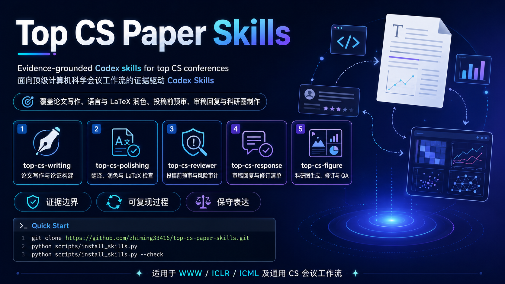
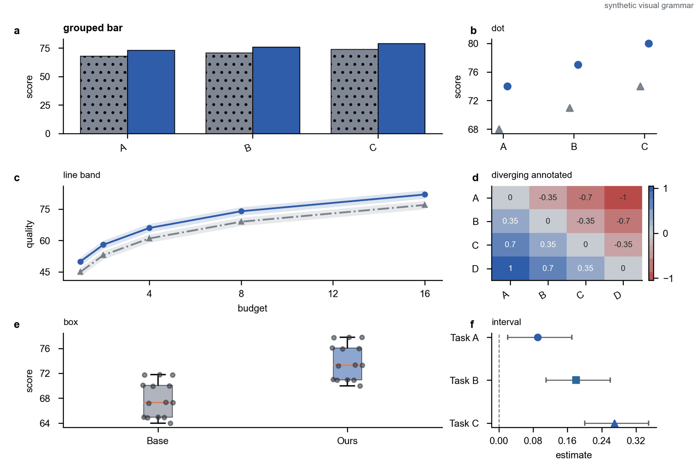
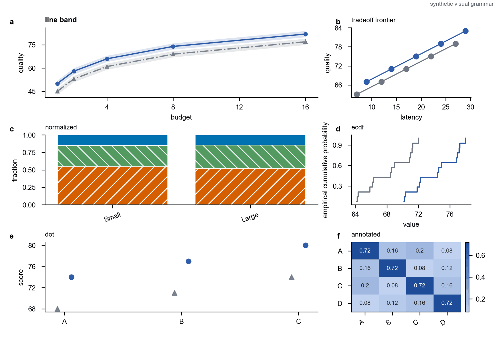
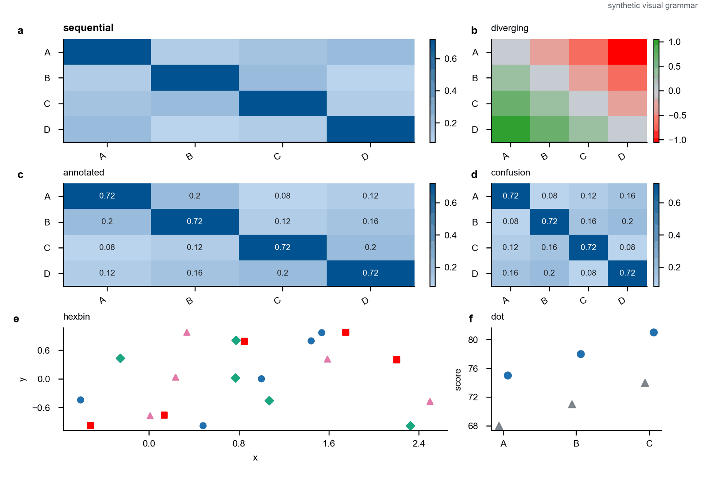

# Top CS Paper Skills

[English](README_EN.md) · [安装](INSTALL.md) · [完整工作流](docs/WORKFLOW.md) · [质量说明](docs/QUALITY.md) · [宿主兼容](docs/HOSTS.md) · [文档导航](docs/README.md)

[](https://github.com/zhiming33416/top-cs-paper-skills/actions/workflows/ci.yml)
[](LICENSE)




> 把作者掌握的研究材料，变为可追溯的顶会投稿产物——不编造实验、引用或会议规则。

六个专项技能覆盖论文论证、文献证据、保真修订、作者侧预审、审稿回复和可复现科研图件。可选协调包只在你选择的论文项目中记录元数据，不上传、不复制稿件。

## 为什么可信

| 原则 | 在仓库中的实际含义 |
| --- | --- |
| 证据谱系 | claim、图件、引用、审稿问题与修订都有稳定 ID 和显式缺口；书目信息匹配绝不被表述为来源支持。 |
| 保守表达 | 缺失的结果、来源摘录、会议规则与作者决定保留为占位符，而不是被流畅文字掩盖。 |
| 可复现检查 | 图件使用可编辑 Python 渲染包和 QA；LaTeX、引用元数据、工作流交接和安装都有确定性检查。 |

当前官方 profile 覆盖 WWW、ICLR、ICML、NeurIPS、CVPR、ACL 2026。profile 随届次过期；未覆盖会议自动使用 `generic` 并提醒作者复核官方指南。`unified-family` 是通用实现风格，不是任何会议的官方配色。

## 10 分钟开始

```bash
git clone https://github.com/zhiming33416/top-cs-paper-skills.git
cd top-cs-paper-skills
python scripts/install_skills.py --host codex
python scripts/install_skills.py --host codex --check
```

从你已经掌握的材料开始：

```text
使用 $top-cs-writing，基于这些结果为 ICLR 引言建立 claim–evidence 大纲。
使用 $top-cs-evidence，把这些贡献主张映射到我提供的 BibTeX 和来源笔记。
使用 $top-cs-figure，基于这份 CSV 和 figure brief 制作可编辑的消融实验图。
```

只有完整、跨阶段论文项目才安装 `--workflow`。Claude Code、按技能安装、更新与安全 `--prune` 见 [INSTALL.md](INSTALL.md)。

## 选择技能

| 你的问题 | 专项技能 | 你提供 | 你得到 | 内置检查 |
| --- | --- | --- | --- | --- |
| 把结果和想法组织成论文论证 | [writing](skills/top-cs-writing/README.md) | 贡献、结果、章节、会议 | claim map、大纲、初稿、缺口 | claim–evidence 边界 |
| 定位工作并核验已有文献 | [evidence](skills/top-cs-evidence/README.md) | claim、BibTeX/DOI、可选摘录 | 来源计划、元数据账本、claim map | 元数据不等于蕴含 |
| 忠实修改英文、中文或 LaTeX | [polishing](skills/top-cs-polishing/README.md) | 原文/LaTeX 与约束 | 修订稿和 ledger | 事实与 LaTeX 保留 |
| 投稿前找出实质风险 | [reviewer](skills/top-cs-reviewer/README.md) | 稿件、图件、附录、会议 | 优先级作者侧审计 | claim、实验、匿名性审计 |
| 真实回应审稿意见 | [response](skills/top-cs-response/README.md) | 评审、证据、修订状态 | 问题板、回复、修订账本 | 不虚构实验或承诺 |
| 制作并审计论文图 | [figure](skills/top-cs-figure/README.md) | CSV、figure brief、render spec | SVG/PDF/PNG 和 QA | 数据/spec/provenance 检查 |

`top-cs-paper-workflow` 是可选协调器，不是第七个专项技能；在需要恢复项目状态时覆盖下列链路：

```text
贡献与主张 → 来源与证据 → 图件 → 写作与修订 → 投稿前预审 → 审稿回复
top-cs-writing  top-cs-evidence  top-cs-figure  top-cs-polishing  top-cs-reviewer  top-cs-response
                              └──── top-cs-paper-workflow（可选）────┘
```

## Golden Task Board

公开看板只使用合成材料。它证明契约、路由、确定性辅助脚本和跨技能交接可用，不把任何模型的文笔宣传成科学质量排名。

| 合成任务 | 可检查产物 | CI 断言 |
| --- | --- | --- |
| Evidence | source plan、metadata ledger、claim map | 不推断来源支持 |
| Writing | 贡献与 claim map | 缺失证据保持显式 |
| Polishing | revision ledger | 数字和引用锚点保留 |
| Figure | render spec 与 export bundle | 可编辑 SVG/PDF/PNG 和 QA |
| Reviewer | consequence-based issue board | 不确定性得到校准 |
| Response | 回复与 revision ledger | 不虚构实验或承诺 |
| Workflow | 项目本地交接图 | advisory 与 strict 状态一致 |

查看 [Golden Task Board](examples/golden-tasks/README.md) 与[质量边界](docs/QUALITY.md)。当前 CI 在 Windows、Ubuntu 运行完整单元、验收、evidence、figure 与安装检查，并在 macOS 运行宿主 smoke。

## 图件能力

图件技能不仅是“换一套配色”：它有 15 个视觉家族、YAML/CSV render spec、Python-first 渲染、SVG/PDF/PNG 导出、配色 provenance、caption/callout 对齐和视觉 QA。

| Benchmark and ablation | Systems scaling | Venue-aware example |
| --- | --- | --- |
|  |  |  |

## 隐私、证据与安装边界

- 仓库只发布原创代码、文档、合成资产与聚合证据；绝不包含用户稿件、审稿文本、原始实验数据或凭据。
- 在线证据核验需作者显式授权，仅查询 Crossref、arXiv、DBLP 的公开元数据，不下载全文。
- 安装器只复制选中的技能、`skills/_shared` 和派生 evidence；不复制 docs、tests、examples 或展示资产，也不写入宿主 settings 文件。
- 将输出用于投稿前，请先阅读[证据与来源](docs/EVIDENCE.md)、[质量与 Golden Tasks](docs/QUALITY.md)和[宿主兼容](docs/HOSTS.md)。

## 仓库结构

```text
skills/                 # 六个专项包、可选协调器与共享契约
evidence/derived/       # 仅公开聚合证据
examples/golden-tasks/  # 合成的契约演示
docs/                   # 工作流、质量、证据、架构与维护文档
tests/                  # 合成单元、验收与 figure 回归夹具
```

## 贡献与许可证

贡献前请阅读 [CONTRIBUTING.md](CONTRIBUTING.md) 的证据、隐私与测试要求。欢迎中英文 Issue 和 PR。本仓库采用 MIT；第三方会议网站与链接来源仍遵循其各自条款。
