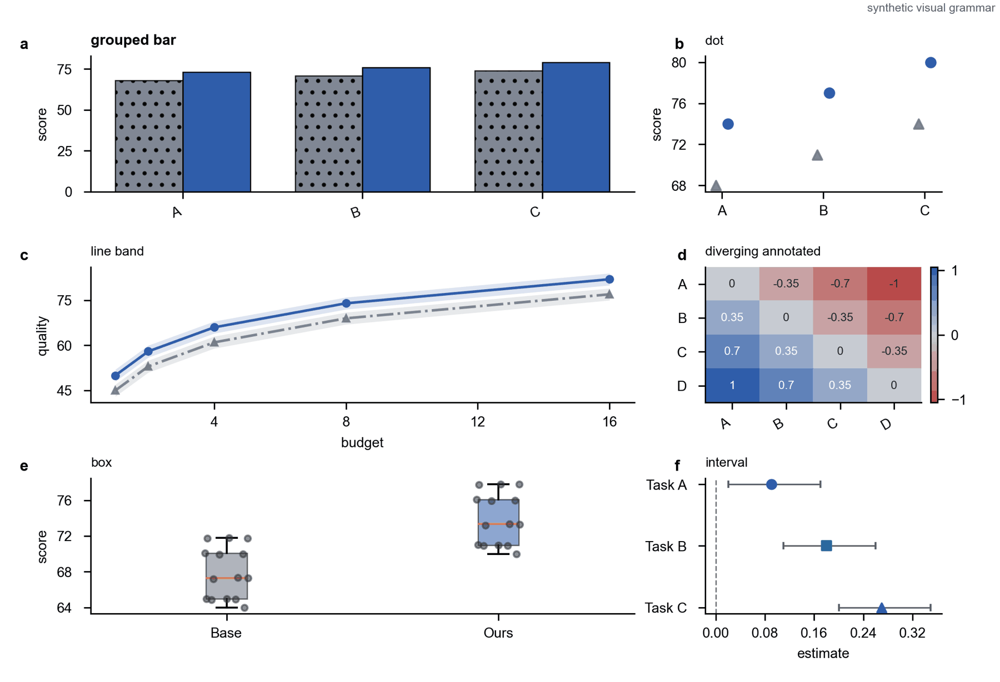
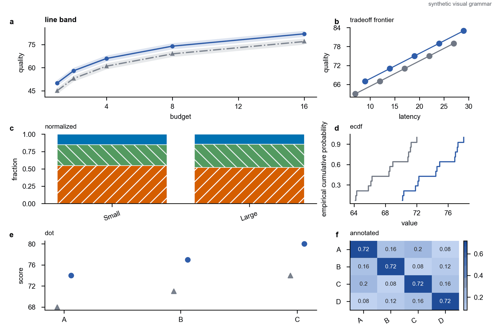
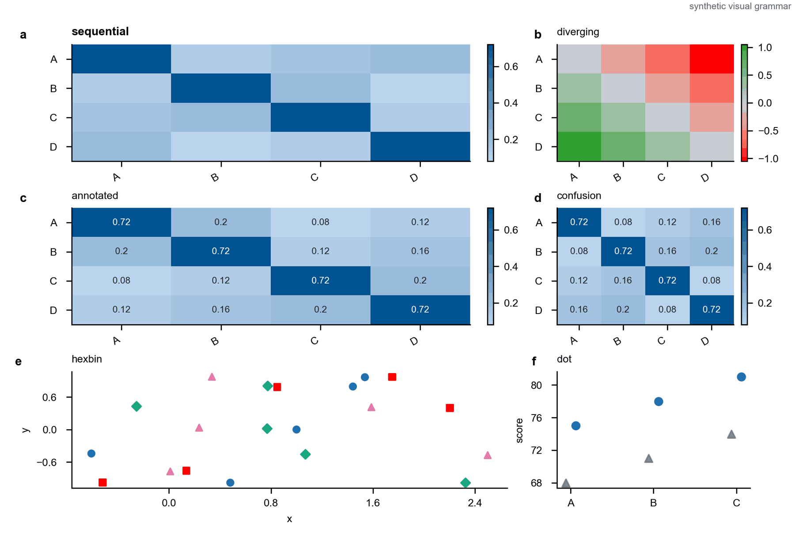

# Top CS Paper Skills

[中文说明](README.md) · [Installation](INSTALL.md) · [Skill index](#skill-index) · [Design and evidence](docs/EVIDENCE.md) · [Contributing](CONTRIBUTING.md)

[](https://github.com/zhiming33416/top-cs-paper-skills/actions/workflows/ci.yml)
[](LICENSE)


Five Codex skills for WWW, ICLR, ICML, and generic computer-science conference workflows: paper writing, prose and LaTeX polishing, pre-submission review, reviewer responses, and scientific figure production.

The skills emphasize evidence boundaries, reproducible workflows, and conservative claims. Conference material and corpus statistics in this repository are not official submission policy. Always verify the current venue website before submitting.

## Quick Start

After installation, give Codex a manuscript, paragraph, experiment data, reviewer comments, or a task description:

| Goal | Example request |
| --- | --- |
| Plan or draft a paper | `Use top-cs-writing to design the argument and Introduction for an ICLR paper from these results.` |
| Polish or translate | `Use top-cs-polishing to rewrite this Chinese paragraph as concise academic English without strengthening its claims.` |
| Run a pre-submission audit | `Use top-cs-reviewer to identify the main rejection risks and reproducibility gaps in this WWW draft.` |
| Respond to reviews | `Use top-cs-response to turn these comments into point-by-point responses and a verifiable revision ledger.` |
| Produce figures | `Use top-cs-figure to create editable SVG/PDF/PNG outputs from this CSV and figure brief.` |

## Skill Index

| Skill | Status | Purpose |
| --- | --- | --- |
| [`top-cs-writing`](skills/top-cs-writing/README_EN.md) | Beta | Build arguments and outlines, then draft paper sections. |
| [`top-cs-polishing`](skills/top-cs-polishing/README_EN.md) | Beta | Translate, compress, restructure, and check LaTeX without changing evidence. |
| [`top-cs-reviewer`](skills/top-cs-reviewer/README_EN.md) | Beta | Simulate a conservative author-side audit of technical, experimental, reproducibility, and venue risks. |
| [`top-cs-response`](skills/top-cs-response/README_EN.md) | Beta | Parse reviewer feedback and draft responses, cover letters, and revision ledgers. |
| [`top-cs-figure`](skills/top-cs-figure/README_EN.md) | Beta | Generate, revise, export, and audit publication-ready figures in Python. |

`skills/_shared/` contains evidence rules, venue material, contracts, and routing resources used by all five skills. It is not a standalone skill.

## Installation

### Recommended: give the repository to Codex

Send Codex this prompt:

```text
Install all Codex skills from this repository:
https://github.com/zhiming33416/top-cs-paper-skills.git

Clone the repository and run python scripts/install_skills.py.
Then run python scripts/install_skills.py --check to verify the installation.
Preserve the complete skills/top-cs-* folders, skills/_shared, and derived evidence;
do not copy only SKILL.md. Remind me to start a new Codex session when finished.
```

### Manual installation

```bash
git clone https://github.com/zhiming33416/top-cs-paper-skills.git
cd top-cs-paper-skills
python scripts/install_skills.py
python scripts/install_skills.py --check
```

Install one or several skills:

```bash
python scripts/install_skills.py --skill top-cs-writing
python scripts/install_skills.py --skill top-cs-writing --skill top-cs-figure
```

The installer targets `~/.codex/skills` by default, always includes `_shared` and derived evidence, and does not delete unrelated Codex skills. See [INSTALL.md](INSTALL.md) for cross-platform installation, updates, and troubleshooting.

## How It Works

The five skills have distinct responsibilities and cooperate through shared contracts:

1. `top-cs-writing` starts from evidence, argument, and section architecture.
2. `top-cs-polishing` revises existing text without inventing missing content.
3. `top-cs-reviewer` performs a conservative author-side submission audit.
4. `top-cs-response` binds review issues, evidence, and revision actions to stable issue IDs.
5. `top-cs-figure` owns figure production and QA from a figure brief, data, or render spec.

See [Architecture](docs/ARCHITECTURE.md) for routing, shared resources, and loading rules.

## Figure Examples

Every preview below uses deterministic synthetic inputs and the repository renderer. No paper screenshots or user data are included.

| Multi-panel experiments | Method and systems | Venue-aware example |
| --- | --- | --- |
|  |  |  |

## Evidence and Boundaries

- Official venue policy and corpus observations remain separate; corpus statistics are soft evidence only.
- The repository contains no raw papers, full review text, private experiment data, or user material.
- The skills do not treat metadata existence as claim entailment and do not fabricate experiments, citations, or reviewer positions.
- `generic` mode provides general argument and evidence checks, not current policy for any venue.

See [Evidence and provenance](docs/EVIDENCE.md) for sources, snapshot coverage, and privacy boundaries.

## Repository Layout

```text
skills/                 # Five installable skills and their shared dependencies
evidence/derived/       # Portable aggregate evidence and source indexes
scripts/                # Installation, routing, validation, and derivation tools
tests/                  # Unit, acceptance, and synthetic figure tests
docs/                   # Architecture, evidence, and development documentation
```

## Development and Contributing

```bash
python -m pip install -r requirements.txt
python -m unittest discover -s tests -p "test_*.py"
python scripts/validate_evidence.py --index evidence/derived/corpus-index.yaml --rules evidence/derived/rules.yaml --strict
python skills/top-cs-figure/scripts/run_figure_evals.py
```

Read [CONTRIBUTING.md](CONTRIBUTING.md) and the [Development guide](docs/DEVELOPMENT.md) before proposing skills, rules, or documentation. Issues and pull requests are welcome in Chinese or English.

## License

This project is available under the [MIT License](LICENSE).
