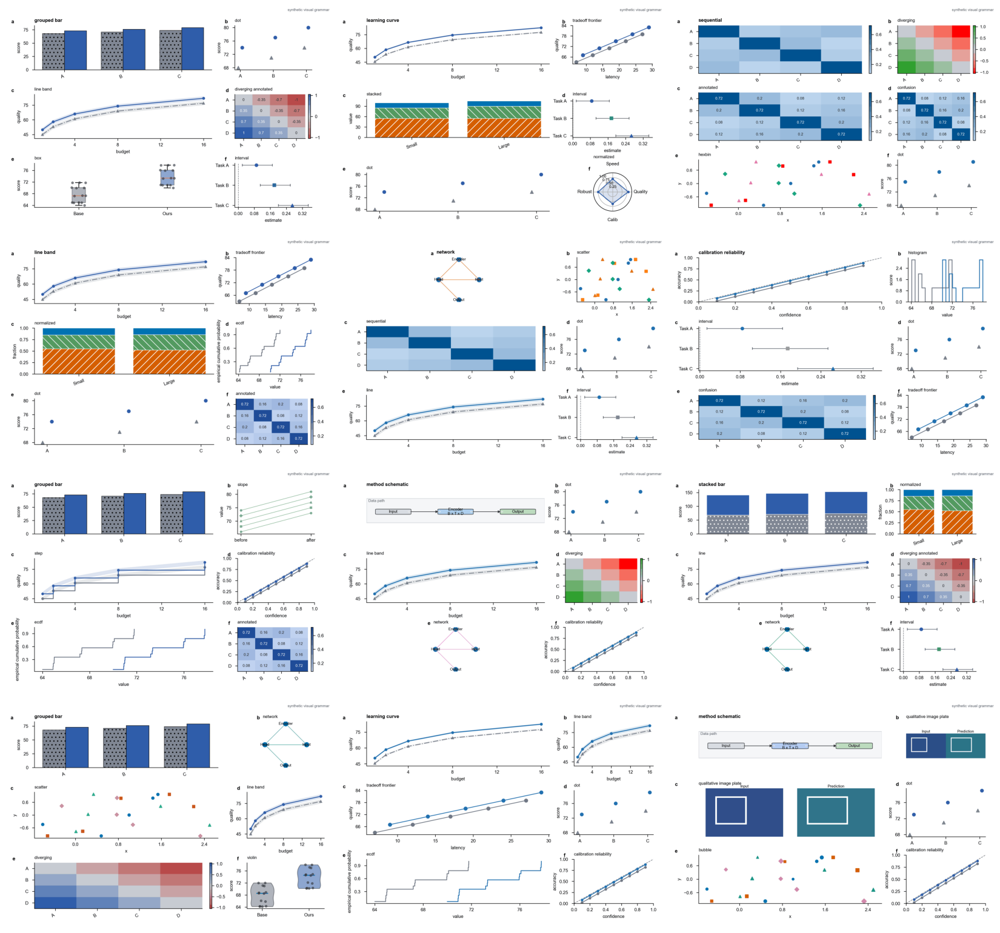

# Top CS Paper Skills

[中文说明](README.md) · [Install](INSTALL.md) · [Workflow](docs/WORKFLOW.md) · [Quality](docs/QUALITY.md) · [Hosts](docs/HOSTS.md) · [Documentation](docs/README.md)

[](https://github.com/zhiming33416/top-cs-paper-skills/actions/workflows/ci.yml)
[](LICENSE)


> Turn author-owned research materials into traceable top-CS submission artifacts — writing, source evidence, figures, revision, pre-submission review, and reviewer response, without inventing experiments, citations, or venue rules.

Six specialist skills for Codex and Claude Code cover the paper lifecycle from "a pile of experiment notes" to "a point-by-point reviewer reply". Current official venue profiles cover WWW, ICLR, ICML, NeurIPS, CVPR, and ACL 2026.

## See the output in 30 seconds

All samples are synthetic. Placeholders are part of the output format: missing evidence is marked explicitly instead of being hidden behind fluent prose.

<details>
<summary><b>Polishing before/after</b> (facts, citation anchors, and numbers preserved)</summary>

**Before:**

> It is generally the case that, in many situations, evaluation reports might potentially conflate things that have actually been measured with things that are merely planned to be measured at some point, which is a problem that could possibly be addressed by having some kind of explicit separation between different states of evidence [syn2026provenance], as illustrated conceptually in the workflow shown in FIG-001.

**After:**

> Evaluation reports often conflate measured results with planned measurements. Separating evidence into explicit states — measured, pending, and author-decided — makes this distinction auditable [syn2026provenance], as illustrated in the conceptual workflow of FIG-001.

A revision ledger labels each change with its type and fact impact; citation and figure anchors are checked one by one. Full sample: [polishing-revision.md](examples/synthetic-paper/outputs/polishing-revision.md).

</details>

<details>
<summary><b>Reviewer response draft</b> (no unverified promises, no invented experiments)</summary>

> We thank the reviewer for identifying this ambiguity. Figure `FIG-001` is a conceptual workflow illustration, not an empirical result. We have updated the caption and the surrounding prose in Section [X] to state "conceptual workflow; no empirical result shown" (revision `REV-001`, status: `pending-author-confirmation`). We do not claim any measured outcome for this figure.

The response explicitly lists what it deliberately does not do: promise new experiments or claim the revision is complete. Full sample: [response-draft.md](examples/synthetic-paper/outputs/response-draft.md).

</details>

<details>
<summary><b>Introduction outline + claim–evidence boundary table</b> (missing citations stay explicit)</summary>

| Claim | Evidence | Status | Boundary |
| --- | --- | --- | --- |
| `CLM-001` evidence-state separation | `EVD-001` planned evaluation record | `pending-author-input` | Workflow claim, not a performance result |

The paragraph-job outline marks `[CITATION NEEDED: ...]` per paragraph, and the draft excerpt keeps its `PENDING-AUTHOR-INPUT` state. Full sample: [writing-claim-outline.md](examples/synthetic-paper/outputs/writing-claim-outline.md).

</details>

Complete input → output samples for all six skills (evidence ledger, reviewer issue board, figure contract) live in [examples/synthetic-paper](examples/synthetic-paper/README.md).

## Start in 10 minutes

```bash
git clone https://github.com/zhiming33416/top-cs-paper-skills.git
cd top-cs-paper-skills
python scripts/install_skills.py --host codex     # or --host claude
python scripts/install_skills.py --host codex --check
```

Then start from the material you already own:

```text
Use $top-cs-writing to build a claim–evidence outline for this ICLR introduction.
Use $top-cs-evidence to map these contribution claims to my BibTeX and source notes.
Use $top-cs-figure to make an editable ablation figure from this CSV and figure brief.
```

Install `--workflow` only for a multi-stage paper project. See [INSTALL.md](INSTALL.md) for Claude Code, selective installs, updates, and safe `--prune`.

## Choose a skill

| Your situation | Specialist | You provide | You receive | Built-in check |
| --- | --- | --- | --- | --- |
| Turn results and ideas into a paper argument | [writing](skills/top-cs-writing/README_EN.md) | Contributions, results, section, venue | Claim map, outline, draft, gaps | Claim–evidence boundary |
| Position work and verify supplied references | [evidence](skills/top-cs-evidence/README_EN.md) | Claims, BibTeX/DOI, optional excerpts | Source plan, metadata ledger, claim map | Metadata ≠ entailment |
| Revise prose or LaTeX without drift | [polishing](skills/top-cs-polishing/README_EN.md) | Existing text/LaTeX and constraints | Revision plus ledger | Fact and LaTeX preservation |
| Find risks before submission | [reviewer](skills/top-cs-reviewer/README_EN.md) | Manuscript, figures, appendix, venue | Prioritized author-side audit | Claim, experiment, and anonymity audit |
| Reply to reviews truthfully | [response](skills/top-cs-response/README_EN.md) | Reviews, evidence, revision state | Issue board, response, revision ledger | No invented promises or changes |
| Render and audit paper figures | [figure](skills/top-cs-figure/README_EN.md) | CSV, figure brief, render spec | SVG/PDF/PNG bundle and QA | Data/spec/provenance checks |

`top-cs-paper-workflow` is an optional coordinator, not a seventh specialist. It overlays the chain below when you need resumable project state:

```text
Contribution and claims → Sources and evidence → Figures → Draft and revision → Pre-submission audit → Response
   top-cs-writing       top-cs-evidence    top-cs-figure    top-cs-polishing    top-cs-reviewer     top-cs-response
                                     └──────── top-cs-paper-workflow (optional) ────────┘
```

## Why not just prompt an LLM directly?

Three systematic risks of bare LLM sessions in paper work are exactly what these skills are designed around:

| Bare-prompt risk | What these skills do instead |
| --- | --- |
| Invented citations; bibliographic matches presented as source support | Citation metadata verification and claim entailment are separate states; without an author excerpt the map is forced to `needs-source-text` |
| Stale venue rules recited from memory | Venue policies come from dated, hash-snapshotted official sources; profiles expire per edition and fall back to `generic` |
| Missing experiments and evidence hidden behind fluent prose | Placeholders (`[CITATION NEEDED]`, `PENDING-AUTHOR-INPUT`) are part of the output contract and protected by deterministic checks |

## Why trust this workflow?

| Principle | What it means in practice |
| --- | --- |
| Evidence lineage | Claims, figures, citations, review issues, and revisions have stable IDs and explicit gaps. Metadata identity is never presented as source-text support. |
| Conservative expression | Missing results, source excerpts, venue rules, and author decisions remain visible placeholders rather than fluent inventions. |
| Reproducible checks | Figures use editable Python-first render bundles and QA; LaTeX, citation metadata, workflow links, and installation have deterministic checks. |

Current official venue profiles cover WWW, ICLR, ICML, NeurIPS, CVPR, and ACL 2026. A profile expires with its edition; unsupported venues use `generic` mode and require the author to re-check official instructions. `unified-family` figure styling is a reusable implementation choice, never an official venue palette.

## Golden Task Board

The public board uses only synthetic materials. It proves that contracts, routes, deterministic helpers, and cross-skill handoffs work; it is not a benchmark claiming that one model writes better science than another. Every task names the public test modules that verify its assertion in a `verified_by` field.

| Synthetic task | Inspectable output | CI assertion |
| --- | --- | --- |
| Evidence | source plan, metadata ledger, claim map | no inferred source support |
| Writing | contribution and claim map | missing evidence remains explicit |
| Polishing | revision ledger | numbers and citation anchors preserved |
| Figure | render spec and export bundle | editable SVG/PDF/PNG plus QA |
| Reviewer | consequence-based issue board | uncertainty stays calibrated |
| Response | response and revision ledger | no fabricated experiment or promise |
| Workflow | project-local handoff graph | advisory and strict status behavior |

Read the [Golden Task Board](examples/golden-tasks/README.md) and [quality boundary](docs/QUALITY.md). All current unit, acceptance, evidence, figure, install, and documentation checks run in CI on Windows, Ubuntu, and macOS smoke targets.

## Figure capability

The figure specialist is deliberately deeper than a style prompt: 15 visual families, YAML/CSV render specs, Python-first rendering, SVG/PDF/PNG exports, palette provenance, caption/callout alignment, and visual QA. Every image below is generated deterministically by the in-repository render pipeline from synthetic inputs:



| Benchmark and ablation | Systems scaling | Venue-aware example |
| --- | --- | --- |
|  |  |  |

## Privacy, evidence, and installation boundary

- The repository releases original code, documentation, synthetic assets, and aggregate evidence only — never user papers, review text, raw experiment data, or credentials.
- Optional online evidence verification queries only public Crossref, arXiv, and DBLP metadata after explicit authorization. It never downloads full text.
- Installation copies selected skills, `skills/_shared`, and derived evidence. It does not copy `docs/`, `tests/`, examples, or repository display assets, and it does not write host settings files.
- Read [Evidence and provenance](docs/EVIDENCE.md), [Quality and Golden Tasks](docs/QUALITY.md), and [Host compatibility](docs/HOSTS.md) before treating any output as submission material.

## Repository map

```text
skills/                 # six specialist packages, optional coordinator, and shared contracts
evidence/derived/       # public aggregate evidence only
examples/golden-tasks/  # synthetic contract demonstrations
examples/synthetic-paper/ # complete synthetic example with inputs and output samples
docs/                   # workflow, quality, evidence, architecture, and maintenance notes
tests/                  # synthetic unit, acceptance, and figure-regression fixtures
```

## Contributing and license

Use [CONTRIBUTING.md](CONTRIBUTING.md) for evidence, privacy, and test requirements. Contributions are welcome in Chinese or English. This repository is MIT-licensed; third-party venue sites and linked sources retain their own terms.
